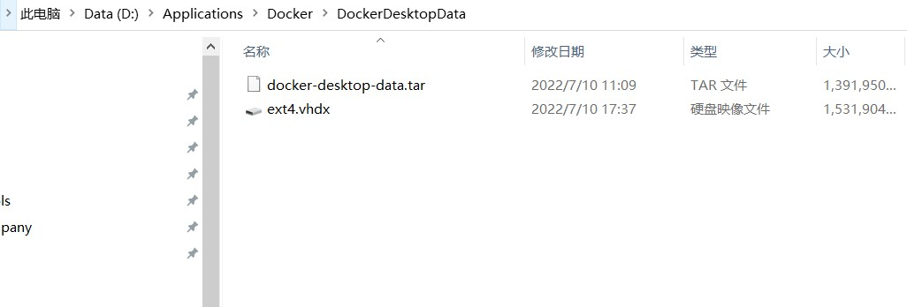

## move Docker data from C disk.
1. stop docker.
2. shutdown all dist : 
```
wsl --shutdown
```
3. export docker desktop data
```
wsl --export docker-desktop-data D:\Applications\Docker\DockerDesktopData\docker-desktop-data.tar
```

4. unregister dock desktop data
```
wsl --unregister docker-desktop-data
```
5. import dock desktop data
```
wsl --import docker-desktop-data D:\Applications\Docker\DockerDesktopData\ D:\Applications\Docker\DockerDesktopData\docker-desktop-data.tar --version 2
```
